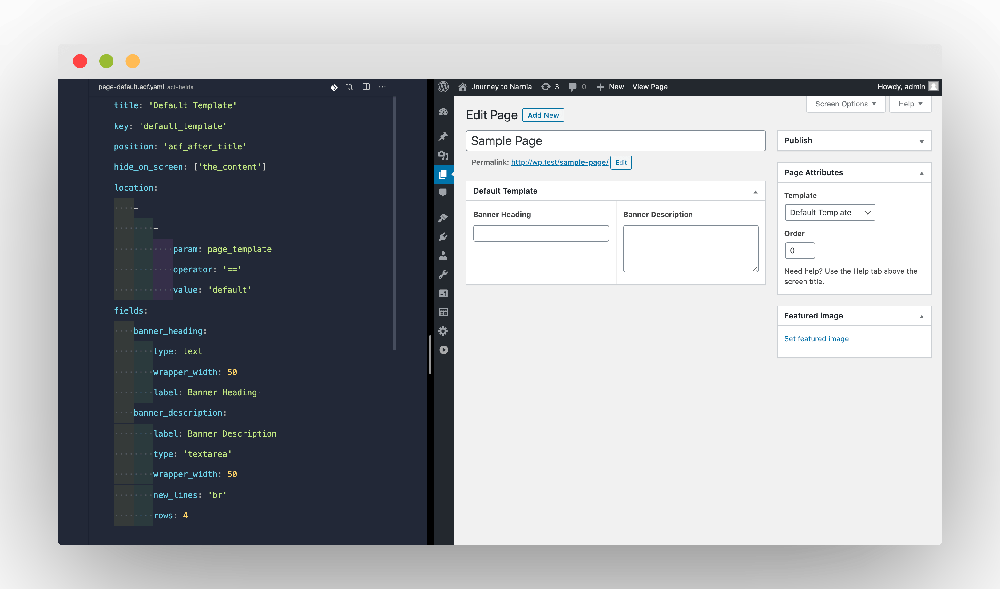

# Introduction

This package extends Advanced Custom Fields plugin for Wordpress and enables developers to write their ACF fields blazingly fast in a configuration file.

- Permanently lock your custom fields in your version-controlled code, preventing accidental edits that quickly leads to out-of-sync configurations.
- Create your fields much faster, especially when complemented with the IDE integration.
- The composition is at the heart of it. You can write your own rules to further supercharge your development productivity.
