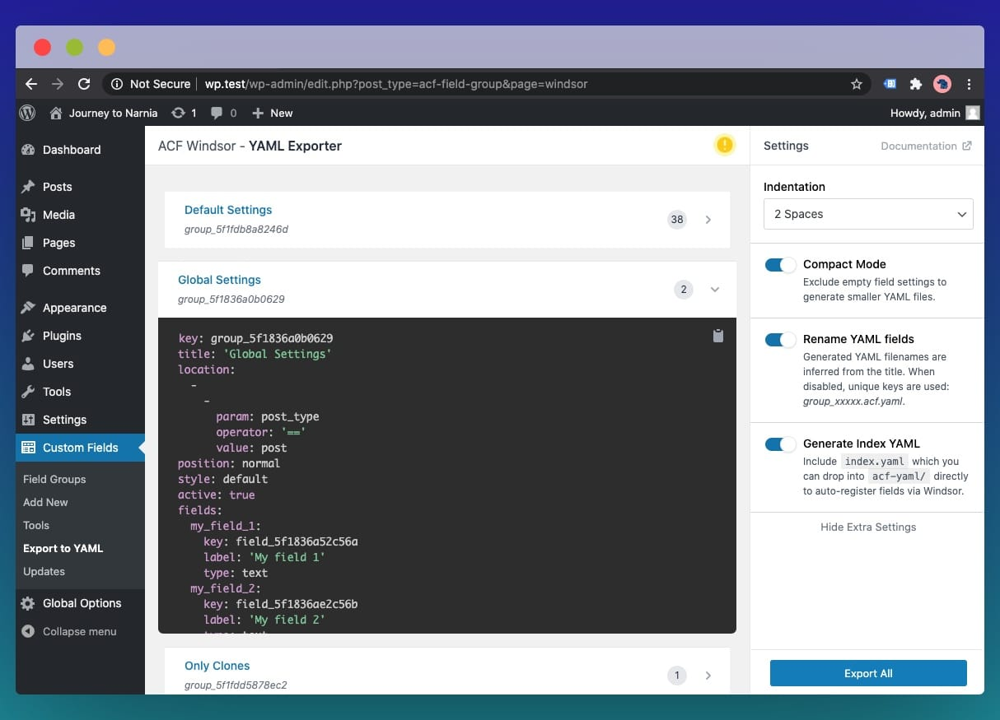

# Configurations

To configure Windsor's behaviour, you may use the `acf-windsor/config` filter. For example:
```php
function modify_windsor_config($config) {
  return array_merge($config, [
    // Change the location of YAML files
    'path' => get_stylesheet_directory() . '/custom-path',
  ]);
}
add_filter('acf-windsor/config', 'modify_windsor_config');
```

`$config` is an array holding configuration values as explained below.

### debug
Boolean flag to enable debug mode. This is useful during development when troubleshooting issues.

Defaults to `false`

### ui
You can set this to `true` to enable YAML export tool which will can be accessed within WordPress administration backend.



Optionally, you can further configure this behaviour by supplying array to the `ui` configuration:

```php
function modify_windsor_config($config) {
  return array_merge($config, [
    'ui' => [
      // {boolean} Same effect as `'ui' => true`
      'enabled' => true,
      // {boolean} Use this to inline Windsor's styles and scripts.
      // This is useful when working with WordPress environment which doesn't allow public url access to `vendor/` directory.
      'inline_assets' => true,
    ]
  ]);
}
add_filter('acf-windsor/config', 'modify_windsor_config');
```

This interface is turned disabled by default, and we recommend keeping it disabled when not in use.

### path
Windsor will attempt to find the entry file and all other YAML files in this location.

Defaults to `acf-fields` directly under your active theme directory.

### entry
The name of the entry file where fields registration happens.

Defaults to `index.yaml`

### parser
Instantiable parser class used to read each fields definition file.

Defaults to `\Windsor\Parser\YamlParser`

### rules
An array of transformation rules when transforming `fields` and `groups`.
You may also use `acf-windsor/config/rules` filter to modify only these rules if preferred.

For more information, refer to [Transformation Rules](/rules)

