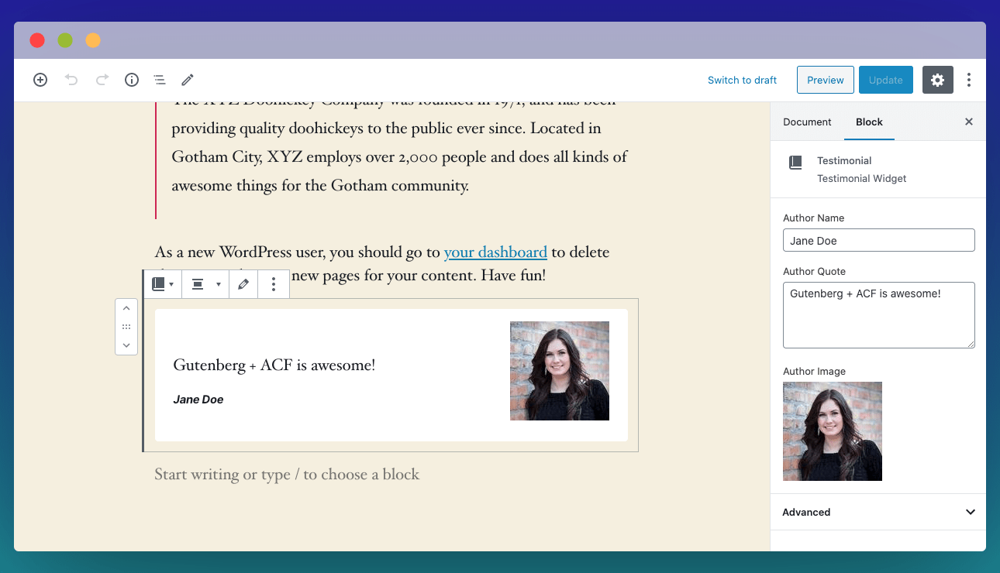

# ACF Blocks

Block fields are configured the same way as normal custom fields, for the most part. Internally, a single block YAML definition in both ACF Block registration (`acf_register_block_type`) **and** custom field group definition.

```yaml
# Top level keys are passed on to Block registration
# you may use any `acf_register_block_type` configuration property here
title: 'My Block'
key: 'my_block'
category: 'widgets'
icon: 'book-alt'
mode: 'edit'
supports:
  align: true
  mode: true
  multiple: true
# Fields are passed onto Custom Fields registration
fields:
  author_name:
    type: text
    label: Author Name
```

:::tip
If you are using our [IDE integration](./.../ide), you can 'New Block' snippet to quickly scaffold the YAML file.
:::

## Handling callbacks

When registering block in ACF, you can optionally use PHP callbacks to render your template using `render_callback` or to enqueue assets programmatically using `enqueue_assets`.

Since ACF Windsor is configuration-based, it is recommended not to write PHP functions directly in your configuration file. Instead, use `handler` property and supply a PHP class which should extend from `\Windsor\AcfBlock`. This class only need to extend `render` and/or `enqueueAssets` method:
- Render your resulting HTML template within `render` method.
- Enqueue your block javascript/stylesheet within `enqueueAssets` method.
Refer to example below on how you use Windsor block handler.

## Example

The following example illustrate how you can organise your Blocks definition using ACF Windsor block handler.

::: tip
The example below assumes that the handler class is using [Composer PSR-4 autoloading](https://getcomposer.org/doc/04-schema.md#psr-4), where `src/` is namespaced to `App\`.
Additionally, we are organising the block where related template, assets and handler class are contained in a single directory. You are free to adopt a different structure according to your development needs.
:::

Start with declaring our custom fields in YAML files:
:::: tabs :options="{ useUrlFragment: false }"

::: tab index.yaml
``` yaml
fields: []
pages: []
blocks:
  - 'testimonial.acf.yaml'
```
:::

::: tab testimonial.acf.yaml
``` yaml
title: 'Testimonial'
key: 'testimonial'
description: 'Testimonial Widget'
category: 'widgets'
icon: 'book-alt'
mode: 'edit'
handler: App\Blocks\Testimonial\TestimonialHandler
supports:
  align: true
  mode: true
  multiple: true
fields:
  author_name:
    type: text
    label: Author Name
  author_quote:
    label: Author Quote
    type: 'textarea'
    new_lines: 'br'
    rows: 4
  author_image:
    label: Author Image
    type: "image"
    preview_size: 'thumbnail'
    max_size: 5 # in MB
    max_width: 2000 # in px
    max_height: 2000 # in px
    return_format: id
```
:::

::::

Next, our PHP handler and the PHP template used to render the HTML output. We will also enqueue custom css, and we will skip enqueuing javascript to keep things simple.

In this example, we are placing all the following files in `src/Blocks/Testimonial` to match our auto-loaded PHP class namespace.

:::: tabs :options="{ useUrlFragment: false }"

::: tab TestimonialHandler.php
```php
<?php
namespace App\Blocks\Testimonial;

class TestimonialHandler extends \Windsor\AcfBlock
{

    /**
     * @inheritDoc
     */
    public function render()
    {
        get_template_part('src/Blocks/Testimonial/testimonial');
    }

    /**
     * @inheritDoc
     */
    public function enqueueAssets()
    {
        wp_enqueue_style('acf-testimonial', get_stylesheet_directory_uri() . '/src/Blocks/Testimonial/testimonial.css');
    }
}
```
:::

::: tab testimonial.php
```php
<?php

/**
 * Testimonial Block Template.
 *
 * @param   array $block The block settings and attributes.
 * @param   string $content The block inner HTML (empty).
 * @param   bool $is_preview True during AJAX preview.
 * @param   (int|string) $post_id The post ID this block is saved to.
 */

// Create id attribute allowing for custom "anchor" value.
$id = 'testimonial-' . $block['id'];
if (!empty($block['anchor'])) {
    $id = $block['anchor'];
}

// Create class attribute allowing for custom "className" and "align" values.
$className = 'testimonial';
if (!empty($block['className'])) {
    $className .= ' ' . $block['className'];
}
if (!empty($block['align'])) {
    $className .= ' align' . $block['align'];
}

// Load values and assign defaults.
$text = get_field('author_quote') ?: 'Your testimonial here...';
$author = get_field('author_name') ?: 'Author name';
$image = get_field('author_image') ?: 295;

?>
<div id="<?php echo esc_attr($id); ?>" class="<?php echo esc_attr($className); ?>">
    <blockquote class="testimonial-blockquote">
        <p class="testimonial-text"><?php echo $text; ?></p>
        <span class="testimonial-author"><?php echo $author; ?></span>
    </blockquote>
    <div class="testimonial-image">
        <?php echo wp_get_attachment_image($image, 'thumbnail'); ?>
    </div>
</div>
```
:::

::: tab testimonial.css
```css
.testimonial {
  display: flex;
  justify-content: space-between;
  align-items: center;
  background: #fff;
  border-radius: 0.25rem;
  padding: 1rem 1.5rem;
}
.testimonial .testimonial-text {
  margin-top: 1rem;
  margin-bottom: 0.25em;
}
.testimonial .testimonial-author {
  font-size: 0.7em;
  font-weight: bold;
  font-style: italic;
}
```
:::

::::

That's all, you should be able to find our newly-registered 'Testimonial' widget within Guternberg editor.




